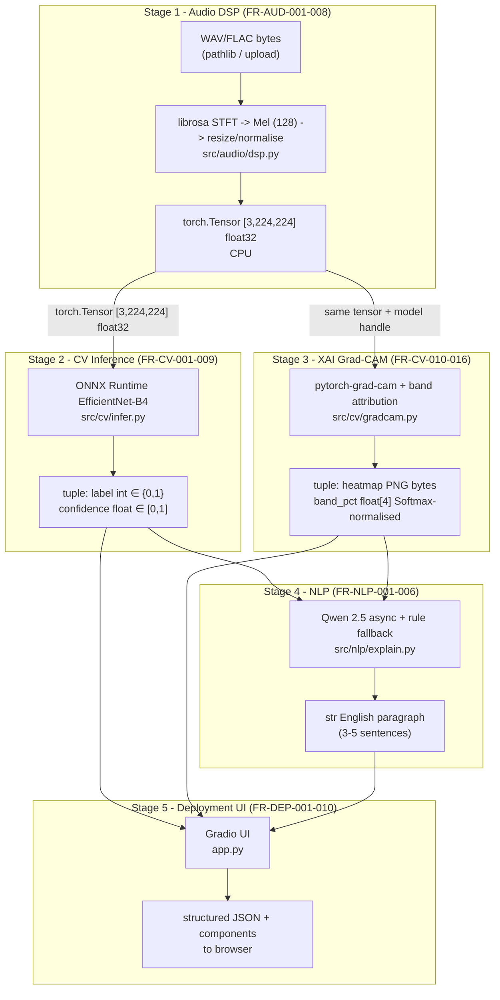

DSDBA - Deepfake Speech Detection & Biometric Authentication System
==========================================================

## Overview

DSDBA is a sequential multimodal pipeline for deepfake speech detection with biometric authentication support:

1. Audio DSP (librosa): WAV/FLAC -> Mel spectrogram -> tensor contract `[3, 224, 224] float32`
2. CV Inference (EfficientNet-B4): binary classification (bonafide / spoof)
3. XAI (Grad-CAM): frequency-band attribution (4 bands)
4. NLP Explanation (Qwen 2.5 async): English explanation with rule-based fallback

## Pipeline Architecture

Mermaid diagram (source: `docs/adr/phase0-pipeline-diagram.md`):



## Installation

```bash
pip install -r requirements.txt
```

All dependencies are pinned in `requirements.txt`.

## Quickstart

1. Install dependencies:
   ```bash
   pip install -r requirements.txt
   ```
2. Open the Colab notebook:
   - `notebooks/dsdba_training.ipynb`
3. Deploy:
   - Create a Hugging Face Space and upload `app.py` + `requirements.txt` (HF Spaces CPU-only).

## Why this matters

DSDBA combines (1) audio preprocessing with a strict tensor contract, (2) EfficientNet-B4 spoof detection via CPU-friendly ONNX Runtime, (3) Grad-CAM frequency-band attribution to support explainability, and (4) async Qwen 2.5 explanations with a rule-based fallback. This design targets reproducible ML development and stable UX under HF Spaces CPU constraints.

## Training (Colab)

Use the scaffold notebook:
- `notebooks/dsdba_training.ipynb`

The notebook includes:
- Q3 VRAM stress test (EfficientNet-B4, batch sizes 16/8/4) with forward + backward + AMP
- Hugging Face login placeholder
- FoR for-2sec dataset download placeholder

## Deployment Demo (HF Spaces)

HF Spaces link (placeholder): `TBD`

### HF Spaces secrets checklist (FR-NLP-005)

Set these **Secrets** in your Hugging Face Space (Settings → Secrets):

- `HF_API_KEY`: API key used by the OpenAI-compatible client to call Hugging Face Inference Chat Completions
- `HF_TOKEN`: Hugging Face token (used for Hub uploads in training utilities)

Notes:
- Do **not** hardcode API keys in code or commit them to git.
- `config.yaml` reads the key name from `nlp.api_key_env_var` (currently `HF_API_KEY`).

## Demo Preview

Insert a short GIF/preview here once the full pipeline is integrated.

## Dataset Citation

Abdel-Dayem, M. (2023). Fake-or-Real (FoR) Dataset. Kaggle.

## Architecture Notes

- CV backbone: EfficientNet-B4 (PyTorch for training; ONNX Runtime for CPU inference)
- XAI: Grad-CAM on `model.features[8]` + 4-band attribution (Softmax-normalised)
- NLP: Qwen 2.5 async explanation with rule-based fallback

## Team

- Ferel, Safa - ITS Informatics | KCVanguard ML Workshop